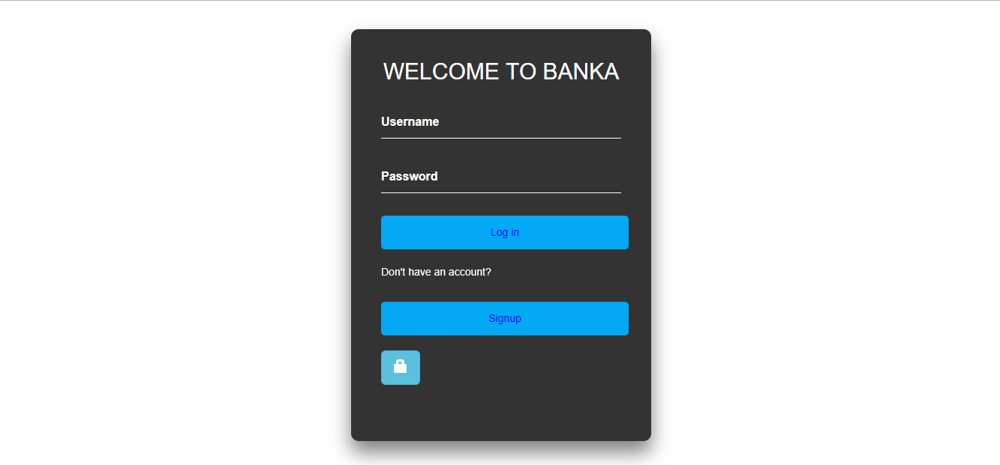

[](https://travis-ci.org/nshutijonathan/Banka)
[](https://coveralls.io/github/nshutijonathan/Banka?branch=develop)
[](https://codeclimate.com/github/nshutijonathan/Banka/maintainability)
# Banka
Banka is core banking application that powers banking operations.It is meant to support a single bank.

# User Interface



## UI Technologies
* HTML.
* CSS.
* Javascript.
### UI link
 [BANKA](https://nshutijonathan.github.io/Banka/ui/html/)

 ### Heroku link Example

[BANKA link](https://bankaweb.herokuapp.com/)

## API ENDPOINTS
| Ressource URL | Methods  | Description  |
| ------- | --- | --- |
| / | GET | The index page |
| /api/v2/auth/signup/client| POST | Sign up |
| /api/v2/auth/signin/client| POST | Sign in |
| /api/v2/users| GET | Get all users |
| /api/v2/users/:id| GET | Get specific user |
| /api/v2/users/:id| DELETE| Delete specific user |
| /api/v2/accounts| POST | Create a user bank account |
| /api/v2/accounts| GET| Get all  users bank accounts |
| /api/v2/accounts/:accountNumber| DELETE| Delete specific user bank account |
| /api/v2/transactions/debit/:accountNumber| POST| Debit specific user bank account |
| /api/v2/transactions/credit/:accountNumber| POST| Credit specific user bank account |
| /api/v2/transactions| GET| Get all users bank account transactions |
## Tools Used

### Language
```
*Javascript*
```
### Server Environment
```
 *NodeJS* 
 ```
### Framework
```
 *Express* 
 ```
### Testing Framework
```
 *Mocha* and *Chai*
 ```
### Style Guide
```
*Airbnb*
```
### Continuous Integration
```
Travis CI
```
### Test Coverage
```
nyc
```
### Git badge
```
coveralls
```
### Deployment
```
Heroku
```
## Getting Started
These instructions will get you a copy of the project up and running on your local machine for development and testing purposes. See deployment for notes on how to deploy the project on a live system.
## Prerequisites
To install the software on your local machine, you need first to clone the repository or download the zip file and once this is set up you are going to need this packages.

```
 [Node Package Installer - NPM] this usually comes with Node.
```

## Installing
The installation of this application is fairly straightforward, After cloning this repository to your local machine,CD into the package folder using your terminal and run the following

```
> npm install
```

It will install the node_modules which will help you run the project on your local machine.

## Run the server
```
> npm run dev
```
## Run the test
```
> npm test
```


## Contributor
Jonathan Nshuti <nshutijonathan130@gmail.com>